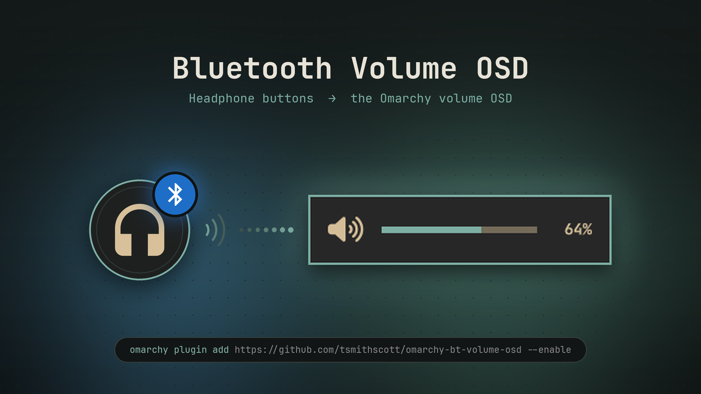

# Bluetooth Volume OSD



An Omarchy shell plugin that shows the stock volume on-screen display when you
change the volume from your **Bluetooth headphones' own buttons**, the same way
it appears when you use the keyboard volume keys.

## Why

Many Bluetooth headphones (e.g. Bose 700, Sony WH-1000XM, AirPods) use AVRCP
*absolute volume*: their buttons set the Bluetooth sink's volume directly in
PipeWire. No `XF86AudioRaiseVolume`/`XF86AudioLowerVolume` key event reaches
Hyprland, so `omarchy-audio-output-volume` never runs and no OSD is shown.

This plugin is a small background service that watches the default audio
output. When it is a Bluetooth sink (`bluez_output.*`) and its volume or mute
state changes, it runs `omarchy-osd` with the same icon and progress the
volume keys use.

- Changes in the first 1.5 s after a sink connects or becomes the default are
  ignored, so you don't get a stray OSD when headphones connect.
- Pressing the keyboard volume keys while on Bluetooth still works as before
  (the OSD just gets refreshed with the same value).

## Install

```bash
omarchy plugin add https://github.com/tsmithscott/omarchy-bt-volume-osd --enable
```

Or manually:

```bash
git clone https://github.com/tsmithscott/omarchy-bt-volume-osd \
  ~/.config/omarchy/plugins/tsmithscott.bt-volume-osd
omarchy-shell shell rescanPlugins
omarchy plugin enable tsmithscott.bt-volume-osd
```

## Remove

```bash
omarchy plugin remove tsmithscott.bt-volume-osd
```

(or `omarchy plugin disable tsmithscott.bt-volume-osd` to keep it installed
but turned off).

## Configuration

To show the OSD for external volume changes on **any** output, not just
Bluetooth, set `bluetoothOnly: false` in `Service.qml`.

## Requirements

- Omarchy (Quattro) with the Quickshell-based `omarchy-shell`
- PipeWire (Omarchy default)

No external dependencies; it only uses `Quickshell.Services.Pipewire` and the
stock `omarchy-osd` command. It does not modify any user configuration.

## License

MIT, see [LICENSE](LICENSE).
